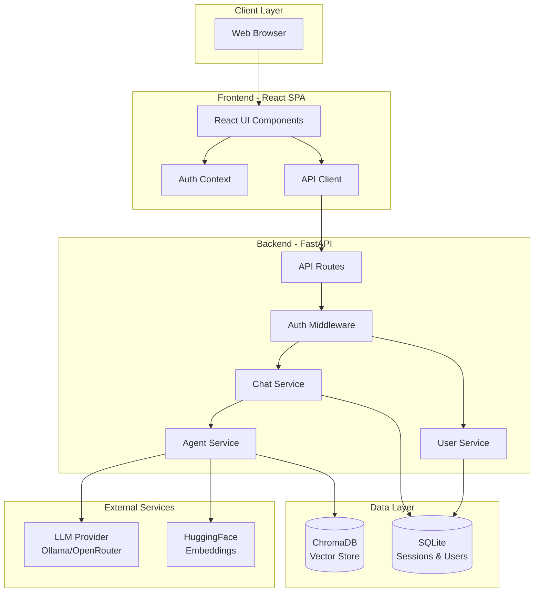
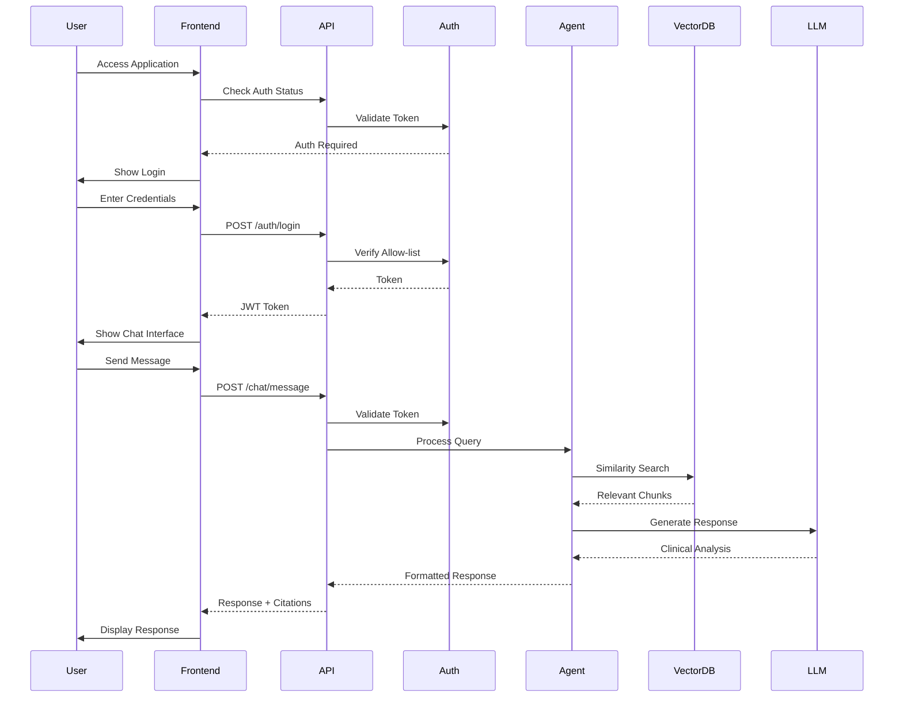
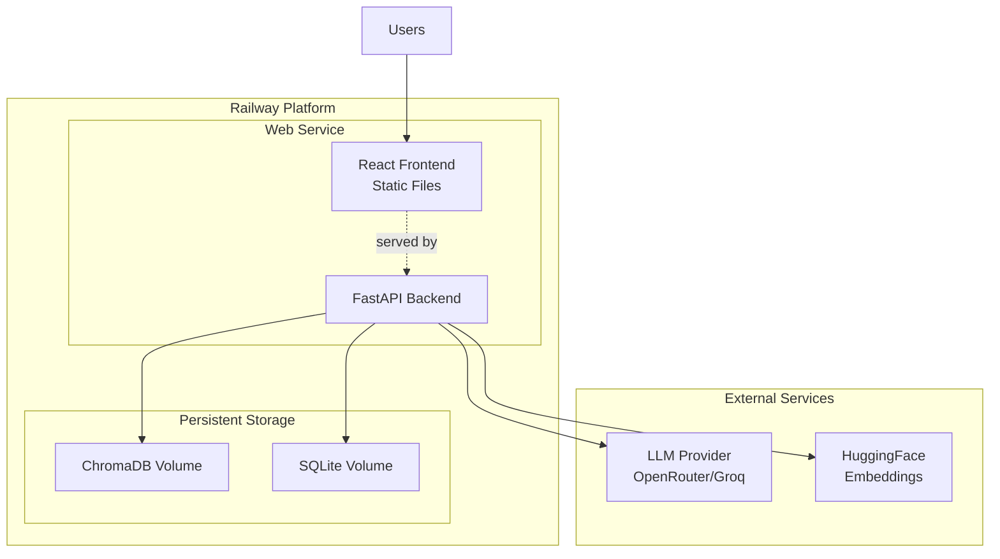

# Design Document

## Overview

This design transforms the console-based psych_agent into a production-grade cloud application with a modern React frontend, Python FastAPI backend, and cost-effective deployment strategy. The architecture prioritizes immediate deployment capability, extensibility, and minimal operational costs while maintaining the clinical reasoning capabilities of the original agent.

The system will use a three-tier architecture:
- **Frontend**: React SPA with modern UI/UX for chat interactions
- **Backend**: FastAPI server exposing RESTful endpoints for agent operations
- **Data Layer**: ChromaDB vector database with persistent storage

For cost-effectiveness without AWS, we'll target deployment on platforms like Railway, Render, or Fly.io which offer:
- Free or low-cost tiers suitable for evaluation
- Simple deployment from Git repositories
- Persistent storage options
- Public URLs with HTTPS
- Easy scaling when needed

## Architecture

### High-Level Architecture



### Component Interaction Flow



### Directory Structure

```
psych-agent/
├── frontend/                    # React application
│   ├── src/
│   │   ├── components/         # Reusable UI components
│   │   │   ├── Chat/
│   │   │   │   ├── ChatInterface.tsx
│   │   │   │   ├── MessageList.tsx
│   │   │   │   ├── MessageInput.tsx
│   │   │   │   └── Message.tsx
│   │   │   ├── Auth/
│   │   │   │   ├── LoginForm.tsx
│   │   │   │   └── ProtectedRoute.tsx
│   │   │   └── Layout/
│   │   │       ├── Header.tsx
│   │   │       └── Sidebar.tsx
│   │   ├── contexts/           # React contexts
│   │   │   ├── AuthContext.tsx
│   │   │   └── ChatContext.tsx
│   │   ├── services/           # API client services
│   │   │   ├── api.ts
│   │   │   ├── auth.ts
│   │   │   └── chat.ts
│   │   ├── types/              # TypeScript types
│   │   │   └── index.ts
│   │   ├── App.tsx
│   │   └── main.tsx
│   ├── package.json
│   └── vite.config.ts
│
├── backend/                     # FastAPI application
│   ├── app/
│   │   ├── api/                # API routes
│   │   │   ├── __init__.py
│   │   │   ├── auth.py
│   │   │   ├── chat.py
│   │   │   └── health.py
│   │   ├── core/               # Core configuration
│   │   │   ├── __init__.py
│   │   │   ├── config.py
│   │   │   ├── security.py
│   │   │   └── dependencies.py
│   │   ├── models/             # Data models
│   │   │   ├── __init__.py
│   │   │   ├── user.py
│   │   │   ├── chat.py
│   │   │   └── message.py
│   │   ├── services/           # Business logic
│   │   │   ├── __init__.py
│   │   │   ├── agent_service.py
│   │   │   ├── chat_service.py
│   │   │   ├── auth_service.py
│   │   │   └── vector_service.py
│   │   ├── db/                 # Database utilities
│   │   │   ├── __init__.py
│   │   │   ├── session.py
│   │   │   └── init_db.py
│   │   ├── main.py             # FastAPI app entry
│   │   └── __init__.py
│   ├── tests/                  # Backend tests
│   └── requirements.txt
│
├── data/                        # Data files
│   └── dsm5-tr.pdf
│
├── vector_db/                   # ChromaDB persistence
│
├── scripts/                     # Utility scripts
│   ├── ingest.py               # Vector DB ingestion
│   └── init_allowlist.py       # Initialize allow-list
│
├── .env.example                # Environment template
├── docker-compose.yml          # Local development
├── Dockerfile                  # Container definition
├── railway.toml                # Railway deployment config
└── README.md                   # Updated documentation
```

## Components and Interfaces

### Frontend Components

#### 1. Authentication Components

**LoginForm.tsx**
- Handles user authentication
- Validates email against allow-list
- Manages JWT token storage
- Props: `onLoginSuccess: () => void`

**ProtectedRoute.tsx**
- Wraps routes requiring authentication
- Redirects to login if unauthenticated
- Props: `children: ReactNode`

#### 2. Chat Components

**ChatInterface.tsx**
- Main chat container component
- Manages chat session state
- Coordinates MessageList and MessageInput
- Props: `sessionId?: string`

**MessageList.tsx**
- Displays conversation history
- Auto-scrolls to latest message
- Renders different message types (user, agent, system)
- Props: `messages: Message[], isLoading: boolean`

**MessageInput.tsx**
- Text input for user queries
- Handles message submission
- Provides character count and validation
- Props: `onSendMessage: (text: string) => void, disabled: boolean`

**Message.tsx**
- Renders individual message
- Formats agent responses with citations
- Displays reasoning steps and disclaimers
- Props: `message: Message, type: 'user' | 'agent' | 'system'`

#### 3. Layout Components

**Header.tsx**
- Application header with branding
- User menu with logout option
- Session management controls

**Sidebar.tsx**
- Chat session history list
- New session button
- Session search/filter

### Backend API Endpoints

#### Authentication Endpoints

```python
POST /api/auth/login
Request: { "email": string, "password": string }
Response: { "access_token": string, "token_type": "bearer", "user": User }

POST /api/auth/logout
Headers: Authorization: Bearer <token>
Response: { "message": "Logged out successfully" }

GET /api/auth/me
Headers: Authorization: Bearer <token>
Response: User
```

#### Chat Endpoints

```python
POST /api/chat/sessions
Headers: Authorization: Bearer <token>
Request: { "title": string? }
Response: ChatSession

GET /api/chat/sessions
Headers: Authorization: Bearer <token>
Response: ChatSession[]

GET /api/chat/sessions/{session_id}
Headers: Authorization: Bearer <token>
Response: ChatSession with messages

POST /api/chat/sessions/{session_id}/messages
Headers: Authorization: Bearer <token>
Request: { "content": string }
Response: { "user_message": Message, "agent_message": Message }

DELETE /api/chat/sessions/{session_id}
Headers: Authorization: Bearer <token>
Response: { "message": "Session deleted" }
```

#### Admin Endpoints

```python
POST /api/admin/allowlist
Headers: Authorization: Bearer <admin_token>
Request: { "email": string }
Response: { "message": "User added to allow-list" }

DELETE /api/admin/allowlist/{email}
Headers: Authorization: Bearer <admin_token>
Response: { "message": "User removed from allow-list" }

GET /api/admin/allowlist
Headers: Authorization: Bearer <admin_token>
Response: string[]
```

#### Health Endpoint

```python
GET /api/health
Response: { "status": "healthy", "vector_db": "connected", "llm": "available" }
```

## Data Models

### User Model

```python
class User(BaseModel):
    id: str  # UUID
    email: str
    is_admin: bool = False
    created_at: datetime
    last_login: datetime
```

### ChatSession Model

```python
class ChatSession(BaseModel):
    id: str  # UUID
    user_id: str
    title: str
    created_at: datetime
    updated_at: datetime
    message_count: int
```

### Message Model

```python
class Message(BaseModel):
    id: str  # UUID
    session_id: str
    role: Literal["user", "agent", "system"]
    content: str
    metadata: dict  # Contains citations, reasoning steps, etc.
    created_at: datetime
```

### AgentResponse Model

```python
class AgentResponse(BaseModel):
    content: str  # Main response text
    reasoning: str  # Chain-of-thought reasoning
    citations: List[Citation]  # DSM-5-TR references
    disclaimer: str  # Clinical disclaimer
    
class Citation(BaseModel):
    source: str  # "DSM-5-TR"
    page: int
    excerpt: str
```

### Database Schema

**SQLite Schema for Sessions and Users:**

```sql
CREATE TABLE users (
    id TEXT PRIMARY KEY,
    email TEXT UNIQUE NOT NULL,
    is_admin BOOLEAN DEFAULT FALSE,
    created_at TIMESTAMP DEFAULT CURRENT_TIMESTAMP,
    last_login TIMESTAMP
);

CREATE TABLE allowlist (
    email TEXT PRIMARY KEY,
    added_by TEXT,
    added_at TIMESTAMP DEFAULT CURRENT_TIMESTAMP
);

CREATE TABLE chat_sessions (
    id TEXT PRIMARY KEY,
    user_id TEXT NOT NULL,
    title TEXT,
    created_at TIMESTAMP DEFAULT CURRENT_TIMESTAMP,
    updated_at TIMESTAMP DEFAULT CURRENT_TIMESTAMP,
    FOREIGN KEY (user_id) REFERENCES users(id)
);

CREATE TABLE messages (
    id TEXT PRIMARY KEY,
    session_id TEXT NOT NULL,
    role TEXT NOT NULL CHECK(role IN ('user', 'agent', 'system')),
    content TEXT NOT NULL,
    metadata TEXT,  -- JSON string
    created_at TIMESTAMP DEFAULT CURRENT_TIMESTAMP,
    FOREIGN KEY (session_id) REFERENCES chat_sessions(id) ON DELETE CASCADE
);

CREATE INDEX idx_sessions_user ON chat_sessions(user_id);
CREATE INDEX idx_messages_session ON messages(session_id);
```

## 
Correctness Properties

*A property is a characteristic or behavior that should hold true across all valid executions of a system—essentially, a formal statement about what the system should do. Properties serve as the bridge between human-readable specifications and machine-verifiable correctness guarantees.*

### Property 1: Agent Response Structure Completeness
*For any* user query submitted to the agent, the generated response should contain all required elements: chain-of-thought reasoning, at least one DSM-5-TR citation, and a clinical disclaimer clearly distinguishing these sections.
**Validates: Requirements 1.3, 1.5, 4.3**

### Property 2: Conversation Context Preservation
*For any* chat session with multiple messages, when a user sends a follow-up message, the agent should have access to all previous messages in that session, and the response should reflect awareness of the conversation history.
**Validates: Requirements 1.2, 4.2**

### Property 3: Allow-list Access Enforcement
*For any* user attempting to authenticate, the system should grant access if and only if the user's email is present in the allow-list at the time of authentication.
**Validates: Requirements 2.1**

### Property 4: Allow-list State Consistency
*For any* user email, adding it to the allow-list should immediately enable authentication for that email, and removing it should prevent authentication on the next attempt.
**Validates: Requirements 2.3, 2.4**

### Property 5: Data Persistence Across Restarts
*For any* data written to persistent storage (allow-list entries, chat sessions, messages, vector database), restarting the application should preserve all data without loss or corruption.
**Validates: Requirements 2.5, 5.5, 10.3**

### Property 6: Session Authentication Round-trip
*For any* valid user credentials, successful authentication should create a session that persists across page refreshes until logout or expiration.
**Validates: Requirements 3.2, 3.5**

### Property 7: Session Cleanup on Logout
*For any* authenticated session, logging out should terminate the session and clear all authentication tokens from the client, preventing further authenticated requests.
**Validates: Requirements 3.4**

### Property 8: Session Isolation
*For any* user with multiple chat sessions, creating a new session or modifying one session should not affect the messages or state of any other session.
**Validates: Requirements 4.4**

### Property 9: Message Chronological Ordering
*For any* chat session, retrieving the message history should return all messages ordered by creation timestamp in ascending order with correct sender identification.
**Validates: Requirements 4.5**

### Property 10: Configuration Externalization
*For any* configuration value (API keys, database paths, LLM settings), the system should read from environment variables or configuration files, and no sensitive values should be hardcoded in the source code.
**Validates: Requirements 7.4**

### Property 11: API Request Validation
*For any* chat message sent to the API, the system should validate the request structure, process it through the agent, and return a response with consistent structure including message IDs and timestamps.
**Validates: Requirements 8.2**

### Property 12: API Error Response Consistency
*For any* error condition in the API (invalid input, authentication failure, server error), the system should return an appropriate HTTP status code (4xx or 5xx) and a JSON error response with a descriptive message.
**Validates: Requirements 8.3**

### Property 13: Authentication Token Validation
*For any* request to a protected API endpoint, the system should validate the authentication token and reject requests with missing, expired, or invalid tokens with a 401 status code.
**Validates: Requirements 8.4**

### Property 14: Concurrent Request Safety
*For any* set of concurrent API requests from multiple users, the system should process all requests without data corruption, ensuring each user's sessions and messages remain isolated and consistent.
**Validates: Requirements 8.5**

### Property 15: UI Loading State Feedback
*For any* user action that triggers backend processing (sending a message, loading a session), the UI should immediately display a loading indicator before the backend response is received.
**Validates: Requirements 9.2, 9.3**

### Property 16: Static Asset Caching
*For any* static asset (JavaScript, CSS, images) served by the application, the HTTP response should include appropriate cache-control headers to enable browser caching.
**Validates: Requirements 9.5**

### Property 17: Embedding Model Consistency
*For any* query to the vector database, the system should use the same embedding model (all-MiniLM-L6-v2) that was used during document ingestion to ensure semantic similarity accuracy.
**Validates: Requirements 10.2**

### Property 18: Embedding Model Caching
*For any* application instance, the embedding model should be loaded into memory once during initialization and reused for all subsequent queries without reloading.
**Validates: Requirements 10.4**

### Property 19: LLM Error Resilience
*For any* LLM inference failure (timeout, service unavailable, rate limit), the system should catch the error, log it, and return a user-friendly error message without crashing.
**Validates: Requirements 11.3**

### Property 20: LLM Usage Logging
*For any* LLM inference request, the system should log the request metadata (timestamp, user, token count) to enable usage tracking and cost analysis.
**Validates: Requirements 11.5**

### Property 21: User Session Retrieval
*For any* authenticated user, the system should retrieve and display only that user's chat sessions, ordered by most recent activity first.
**Validates: Requirements 12.1**

### Property 22: Session Message Completeness
*For any* chat session, loading the session should retrieve all messages associated with that session in chronological order without omissions.
**Validates: Requirements 12.2**

### Property 23: Session Creation Consistency
*For any* new session created by a user, the session should immediately appear in the user's session list with a creation timestamp and be associated with the authenticated user.
**Validates: Requirements 12.3**

### Property 24: Session Deletion Cascade
*For any* chat session, deleting the session should remove the session record and all associated messages from storage, and the session should no longer appear in the user's session list.
**Validates: Requirements 12.4**

### Property 25: Session Access Control
*For any* chat session, only the user who created the session should be able to view, modify, or delete it; attempts by other users should be rejected with a 403 status code.
**Validates: Requirements 12.5**

## Error Handling

### Frontend Error Handling

1. **Network Errors**
   - Display user-friendly messages for connection failures
   - Implement retry logic with exponential backoff
   - Show offline indicator when backend is unreachable

2. **Authentication Errors**
   - Redirect to login on 401 responses
   - Clear invalid tokens from storage
   - Display specific error messages for login failures

3. **Validation Errors**
   - Show inline validation messages for form inputs
   - Prevent submission of invalid data
   - Highlight fields with errors

4. **Agent Errors**
   - Display error messages when agent fails to respond
   - Provide option to retry failed queries
   - Log errors for debugging

### Backend Error Handling

1. **Request Validation**
   - Use Pydantic models for automatic validation
   - Return 422 status with detailed validation errors
   - Sanitize inputs to prevent injection attacks

2. **Authentication Errors**
   - Return 401 for missing/invalid tokens
   - Return 403 for insufficient permissions
   - Log authentication failures for security monitoring

3. **Database Errors**
   - Catch and log database exceptions
   - Return 500 with generic error message to client
   - Implement connection retry logic

4. **LLM Errors**
   - Catch timeout and connection errors
   - Implement retry logic with exponential backoff
   - Return user-friendly error message
   - Log errors with context for debugging

5. **Vector Database Errors**
   - Handle missing or corrupted index
   - Provide fallback behavior when retrieval fails
   - Log errors for investigation

### Error Response Format

All API errors should follow this structure:

```json
{
  "error": {
    "code": "ERROR_CODE",
    "message": "Human-readable error message",
    "details": {
      "field": "Additional context"
    }
  }
}
```

## Testing Strategy

### Unit Testing

**Backend Unit Tests:**
- Test individual service methods in isolation
- Mock external dependencies (LLM, vector DB)
- Test data models and validation logic
- Test utility functions and helpers
- Coverage target: 80% for core business logic

**Frontend Unit Tests:**
- Test individual React components with React Testing Library
- Test custom hooks and context providers
- Test utility functions and API client methods
- Mock API calls and external dependencies
- Coverage target: 70% for components and utilities

**Key Unit Test Areas:**
- Authentication service logic
- Chat session management
- Message formatting and parsing
- API request/response handling
- Form validation logic

### Property-Based Testing

Property-based tests will verify universal properties using a PBT library. For Python backend, we'll use **Hypothesis**. For TypeScript frontend, we'll use **fast-check**.

**Backend Property Tests (Hypothesis):**
- Each property test should run a minimum of 100 iterations
- Use custom strategies to generate valid test data
- Tag each test with the property number from this design document

**Frontend Property Tests (fast-check):**
- Each property test should run a minimum of 100 iterations
- Generate random user inputs and API responses
- Verify UI state consistency

**Property Test Configuration:**

Python (pytest with Hypothesis):
```python
from hypothesis import given, settings
import hypothesis.strategies as st

@settings(max_examples=100)
@given(st.text(min_size=1))
def test_property_1_agent_response_structure(query):
    """Feature: cloud-psychiatry-app, Property 1: Agent Response Structure Completeness"""
    # Test implementation
```

TypeScript (Jest with fast-check):
```typescript
import fc from 'fast-check';

test('Property 15: UI Loading State Feedback', () => {
  fc.assert(
    fc.property(fc.string(), async (message) => {
      // Feature: cloud-psychiatry-app, Property 15: UI Loading State Feedback
      // Test implementation
    }),
    { numRuns: 100 }
  );
});
```

### Integration Testing

**API Integration Tests:**
- Test complete request/response cycles
- Test authentication flows end-to-end
- Test chat session creation and message exchange
- Test error scenarios with real database
- Use test database instance

**Frontend Integration Tests:**
- Test user flows with mocked API
- Test authentication flow
- Test chat interaction flow
- Test session management

### End-to-End Testing

**Critical User Flows:**
- User login → Create session → Send message → Receive response
- User login → View session history → Load previous session
- Admin login → Add user to allow-list → New user login

**E2E Test Tools:**
- Playwright or Cypress for browser automation
- Test against deployed staging environment
- Run before production deployments

### Testing Best Practices

1. **Test Pyramid**: More unit tests, fewer integration tests, minimal E2E tests
2. **Test Isolation**: Each test should be independent and not rely on others
3. **Test Data**: Use factories or fixtures for consistent test data
4. **Mocking**: Mock external services (LLM, embeddings) in unit tests
5. **CI Integration**: Run tests automatically on pull requests
6. **Coverage Monitoring**: Track coverage trends over time

## Deployment Strategy

### Platform Selection

**Recommended Platform: Railway.app**

Reasons:
- No AWS account required
- Free tier available ($5 credit/month)
- Simple Git-based deployment
- Persistent volume support for databases
- Environment variable management
- Automatic HTTPS
- Easy scaling when needed

**Alternative Platforms:**
- Render.com (similar features, free tier)
- Fly.io (more technical, good for Docker)
- Heroku (more expensive, but mature)

### Deployment Architecture



### Deployment Configuration

**Railway Configuration (railway.toml):**

```toml
[build]
builder = "DOCKERFILE"
dockerfilePath = "Dockerfile"

[deploy]
startCommand = "uvicorn app.main:app --host 0.0.0.0 --port $PORT"
healthcheckPath = "/api/health"
healthcheckTimeout = 100
restartPolicyType = "ON_FAILURE"
restartPolicyMaxRetries = 10

[[volumes]]
name = "vector_db"
mountPath = "/app/vector_db"

[[volumes]]
name = "data"
mountPath = "/app/data"
```

### Docker Configuration

**Dockerfile:**

```dockerfile
FROM python:3.11-slim

WORKDIR /app

# Install system dependencies
RUN apt-get update && apt-get install -y \
    build-essential \
    && rm -rf /var/lib/apt/lists/*

# Copy requirements and install Python dependencies
COPY backend/requirements.txt .
RUN pip install --no-cache-dir -r requirements.txt

# Copy application code
COPY backend/ ./backend/
COPY data/ ./data/
COPY vector_db/ ./vector_db/

# Build frontend
COPY frontend/package.json frontend/package-lock.json ./frontend/
RUN cd frontend && npm ci

COPY frontend/ ./frontend/
RUN cd frontend && npm run build

# Move built frontend to backend static directory
RUN mkdir -p backend/static && \
    cp -r frontend/dist/* backend/static/

# Expose port
EXPOSE 8000

# Run application
CMD ["uvicorn", "backend.app.main:app", "--host", "0.0.0.0", "--port", "8000"]
```

### Environment Variables

Required environment variables for deployment:

```bash
# Application
ENVIRONMENT=production
SECRET_KEY=<random-secret-key>
ALLOWED_ORIGINS=https://your-app.railway.app

# Database
DATABASE_URL=sqlite:///./data/app.db
VECTOR_DB_PATH=./vector_db

# LLM Configuration
LLM_PROVIDER=openrouter  # or groq, ollama
LLM_API_KEY=<api-key>
LLM_MODEL=deepseek/deepseek-r1

# Embeddings
EMBEDDING_MODEL=all-MiniLM-L6-v2

# Authentication
JWT_SECRET_KEY=<random-jwt-secret>
JWT_ALGORITHM=HS256
JWT_EXPIRATION_HOURS=24

# Admin
ADMIN_EMAIL=admin@example.com
```

### Cost-Effective LLM Options

Since you don't have an AWS account and need cost-effectiveness:

1. **OpenRouter** (Recommended)
   - Pay-as-you-go pricing
   - Access to multiple models including DeepSeek
   - DeepSeek-R1: ~$0.14 per 1M tokens (very cheap)
   - No monthly commitment
   - Simple API integration

2. **Groq**
   - Free tier available
   - Very fast inference
   - Limited model selection
   - Good for evaluation phase

3. **Together.ai**
   - Competitive pricing
   - Good model selection
   - Free trial credits

4. **Self-hosted (Future)**
   - Run Ollama on a separate server
   - One-time hardware cost
   - No per-query costs
   - Requires more setup

**Recommended for MVP: OpenRouter with DeepSeek-R1**
- Extremely low cost (~$0.14 per 1M tokens)
- Good reasoning capabilities
- No infrastructure management
- Easy to switch providers later

### Deployment Process

1. **Initial Setup:**
   ```bash
   # Install Railway CLI
   npm install -g @railway/cli
   
   # Login to Railway
   railway login
   
   # Create new project
   railway init
   
   # Add volumes for persistence
   railway volume create vector_db
   railway volume create data
   ```

2. **Configure Environment Variables:**
   ```bash
   # Set variables via CLI or Railway dashboard
   railway variables set SECRET_KEY=<value>
   railway variables set LLM_API_KEY=<value>
   # ... set all required variables
   ```

3. **Deploy:**
   ```bash
   # Deploy from current directory
   railway up
   
   # Or connect to GitHub for automatic deployments
   railway link
   ```

4. **Initialize Database:**
   ```bash
   # Run initialization script
   railway run python scripts/init_db.py
   
   # Add admin to allow-list
   railway run python scripts/init_allowlist.py admin@example.com
   ```

### Continuous Deployment

**GitHub Integration:**
- Connect Railway to GitHub repository
- Automatic deployments on push to main branch
- Preview deployments for pull requests
- Rollback capability through Railway dashboard

**Deployment Workflow:**
1. Push code to GitHub
2. Railway detects changes
3. Builds Docker image
4. Runs health checks
5. Deploys new version
6. Maintains previous version if deployment fails

### Monitoring and Maintenance

**Health Checks:**
- `/api/health` endpoint for service status
- Railway automatic health monitoring
- Email alerts on service failures

**Logging:**
- Application logs via Railway dashboard
- Structured logging with Python logging module
- Log levels: DEBUG (dev), INFO (prod)

**Metrics to Monitor:**
- API response times
- LLM token usage
- Error rates
- Active user sessions
- Database size

### Scaling Considerations

**Vertical Scaling (Railway):**
- Start with smallest instance ($5/month)
- Scale up CPU/memory as needed
- Railway provides easy instance resizing

**Horizontal Scaling (Future):**
- Add load balancer
- Multiple backend instances
- Shared database and vector store
- Session management with Redis

**Cost Optimization:**
- Use Railway's sleep feature for non-production environments
- Monitor LLM token usage
- Implement response caching for common queries
- Optimize vector DB chunk size for retrieval efficiency

## Security Considerations

### Authentication Security

1. **JWT Tokens:**
   - Use strong secret keys (256-bit minimum)
   - Set appropriate expiration times
   - Implement token refresh mechanism
   - Store tokens securely in httpOnly cookies (not localStorage)

2. **Password Handling:**
   - Hash passwords with bcrypt (cost factor 12+)
   - Implement password strength requirements
   - Rate limit login attempts
   - Log failed authentication attempts

3. **Session Management:**
   - Implement session timeout
   - Invalidate sessions on logout
   - Detect and prevent session hijacking

### API Security

1. **Input Validation:**
   - Validate all inputs with Pydantic models
   - Sanitize user inputs to prevent injection
   - Implement request size limits
   - Rate limit API endpoints

2. **CORS Configuration:**
   - Whitelist specific origins
   - Don't use wildcard (*) in production
   - Validate Origin header

3. **HTTPS:**
   - Enforce HTTPS in production
   - Use HSTS headers
   - Redirect HTTP to HTTPS

### Data Security

1. **Database:**
   - Encrypt sensitive data at rest
   - Use parameterized queries
   - Implement proper access controls
   - Regular backups

2. **Secrets Management:**
   - Never commit secrets to Git
   - Use environment variables
   - Rotate secrets regularly
   - Use different secrets for dev/prod

3. **User Data:**
   - Implement data retention policies
   - Allow users to delete their data
   - Log access to sensitive data
   - Comply with privacy regulations

### Infrastructure Security

1. **Network:**
   - Use Railway's built-in DDoS protection
   - Implement rate limiting
   - Monitor for suspicious activity

2. **Dependencies:**
   - Regularly update dependencies
   - Use Dependabot for security alerts
   - Audit dependencies for vulnerabilities

3. **Logging:**
   - Log security events
   - Don't log sensitive data
   - Implement log retention policies
   - Monitor logs for anomalies

## Future Extensibility

### Planned Extensions

1. **Multi-source Knowledge Base:**
   - Add medical journals and research papers
   - Implement source selection in UI
   - Support multiple vector databases
   - Citation tracking across sources

2. **Advanced Features:**
   - Export conversations as PDF
   - Share sessions with colleagues
   - Annotation and highlighting
   - Bookmark important responses

3. **Analytics:**
   - Usage dashboards for admins
   - Query pattern analysis
   - Response quality metrics
   - User feedback collection

4. **Collaboration:**
   - Multi-user sessions
   - Comments and discussions
   - Case study creation
   - Team workspaces

### Architecture for Extension

The modular architecture supports extension through:

1. **Service Layer Pattern:**
   - New features added as services
   - Minimal changes to existing code
   - Clear dependency injection

2. **Plugin Architecture:**
   - New data sources as plugins
   - Custom LLM providers
   - Additional authentication methods

3. **API Versioning:**
   - Support multiple API versions
   - Gradual migration path
   - Backward compatibility

4. **Database Migrations:**
   - Alembic for schema changes
   - Version-controlled migrations
   - Rollback capability

This design provides a solid foundation for immediate deployment while maintaining the flexibility needed for future productionization and feature expansion.
